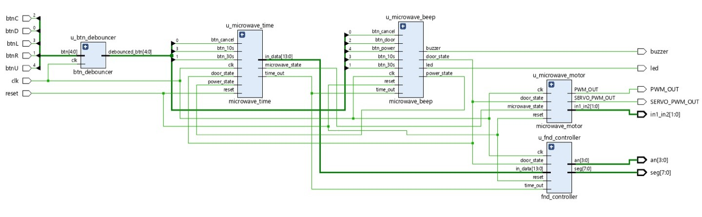
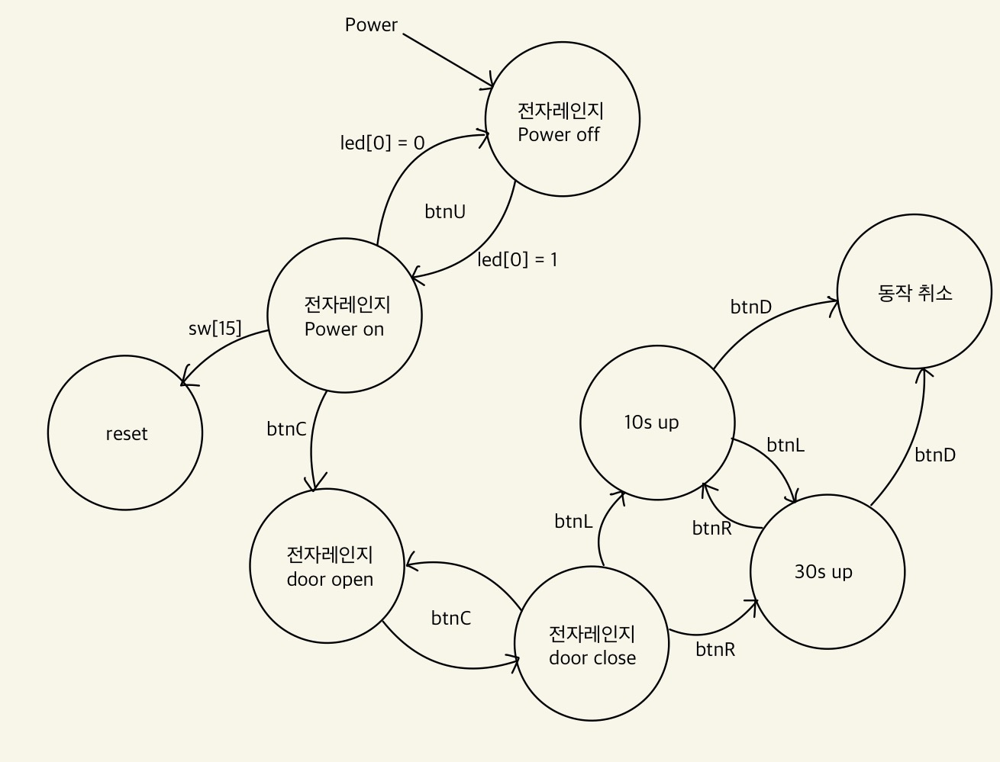

# Microwave Oven
## Basys3 보드와 DC motor, surbo motor를 이용한 전자레인지 설계 및 구현
1. btn, led, sw
    - btnU : 전자레인지 power on/off
    - btnL : 10초씩 증가
    - btnC : 전자레인지 문 open/close
    - btnR : 30초씩 증가
    - btnD : 전자레인지 취소
    - led[0] : 전자레인지 on/off 확인
    - sw[15] : reset
2. FND/buzzer
    - 모든 버튼 누를때마다 beep음 발생
    - 문 open/close, power on 시 buzzer음 발생
    - power off 시 종료 노래 재생
    - 전자레인지 동작 시 1.3초마다 circle 동작 / 남은 시간 번갈아 표시
    - timer 시간 종료 시 완료를 알리는 beep음, 00:00 출력 3번 발생
3. DC/surbo motor
    - 전자레인지 동작 시 DC 모터 동작, 종료시 DC 모터 종료
    - 문 open : surbo-180도, close : surbo-0도

---
## Block Diagram

---
## FSM

---
## TroubleShooting
- time_out과 각종 state를 관리하여 output으로 보내는 모듈을 따로 만들고 싶었으나, 그 조건들이 timer, beep, motor의 동작 과정과 겹치는 부분이 많아 결국 각 동작 모듈 내부에서 output으로 뽑아오게 됨.

- timer, motor, beep 세 동작 모듈과 fnd_controller로 구성하여 각 동작들을 분리하되, timer가 끝나면 beep 세번 울리는 것이나 surbo motor(문)이 열리면, timer가 멈추는 등 유기적으로 연동될 수 있도록 각 state를 관리하는 최적화 방법을 찾는 것이 어려웠음.

- 전자레인지 기능을 추가/변경하는 관점에서 모듈의 재활용성을 생각하면, state 관리는 따로 이루어져야 맞다고 생각.
